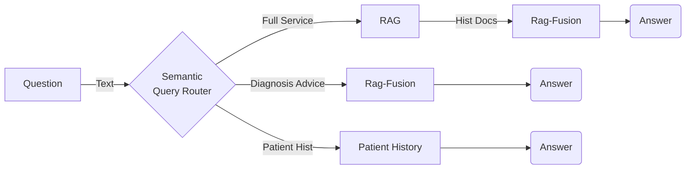
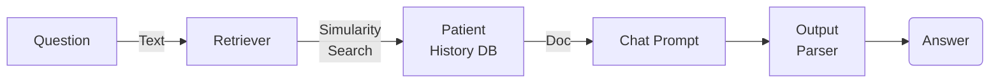
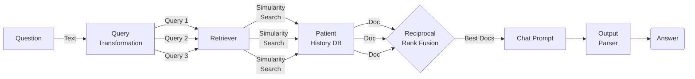
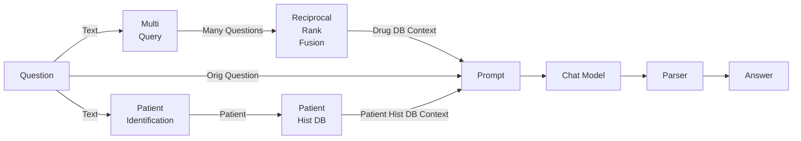
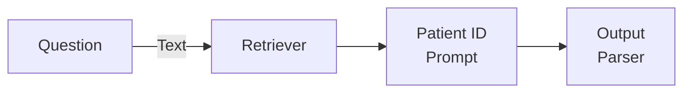
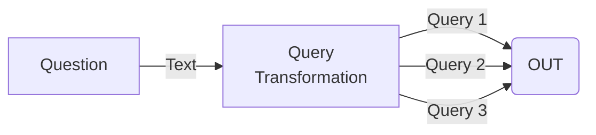
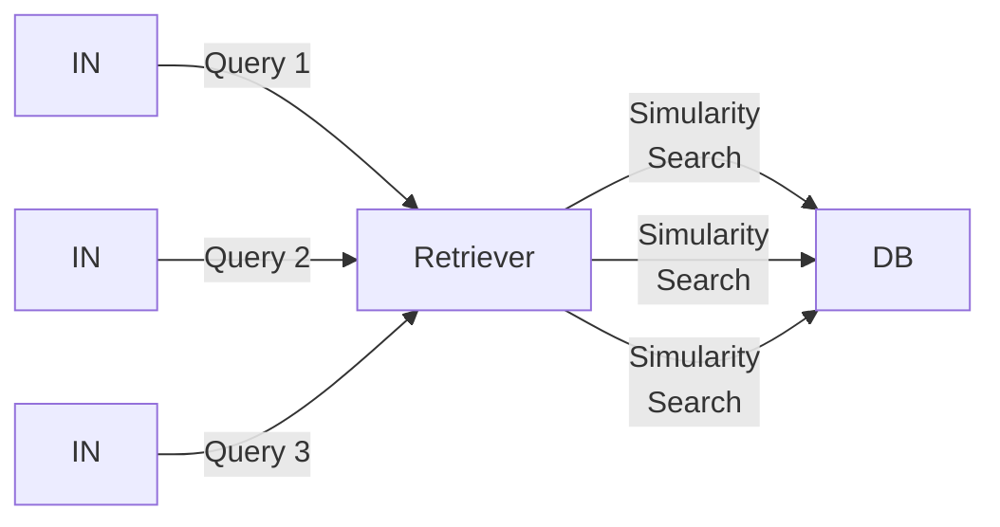

# Treatment Checker

## Overview
This is a toy version of a system which helps diagnose patients using Retrieval Augmented Generation and Langchain.

It demonstrates serveral fun and interesting techniques such as:
* RAG with reciprocal rank fusion (RAG-Fusion).
* Semantic search with vector stores.
* Semantic query classification and routing.
* Few-shot prompt engineering.
* Output schema enforcement with output parsers.
* Langchain component chaining.

## Processes
The system is divided into three distinct processes, providing 3 similar elements of functionality. All functionality is based on a user query, which is classified then routed to the relevent process.

#### Patient History Process: 
This process is designed to answer questions about a specific patient’s medical history.

#### Diagnosis Advice Process:
This process provides suggestions for a drug to diagnose based on symptoms from the app’s drug database.

#### Full Service Process:
This process makes drug recommendations based on the patient’s medical history and the available drugs in the drug database.

*Simplified*

*Patient Identification Sub-Process*

*Multi Query Sub-Process*

*Reciprocal Rank Fusion Sub-Process*

